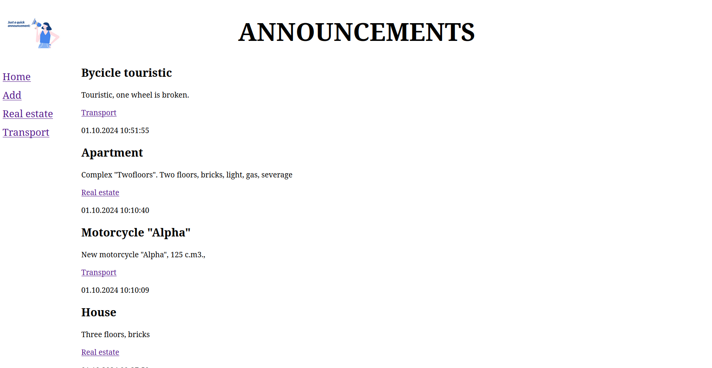

# sample_site
This is simple site for announcements

Steps for installing project:
1. git remote add origin https://github.com/TsybuliaRoman/sample_site.git
2. source venv/bin/activate
3. pip install requirements.txt
4. python manage.py runserver
5. 